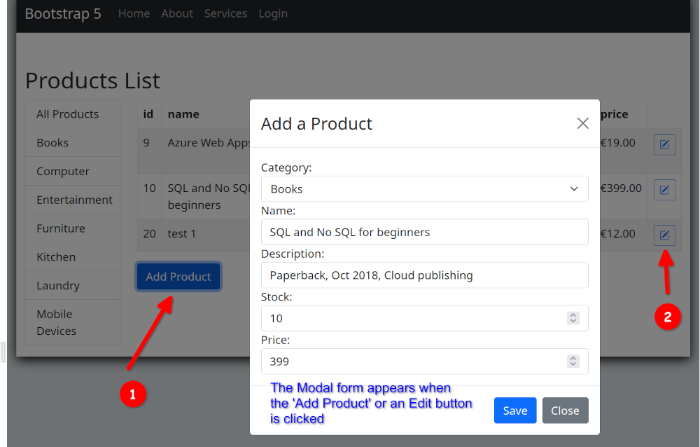
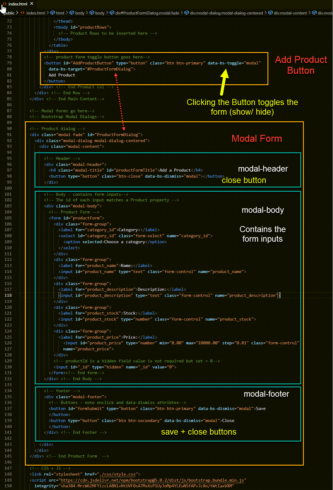
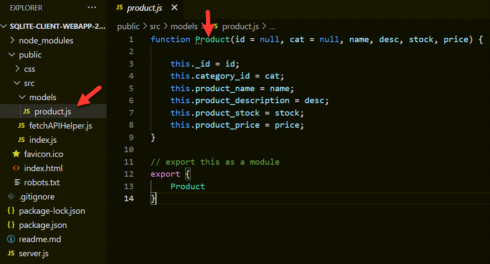
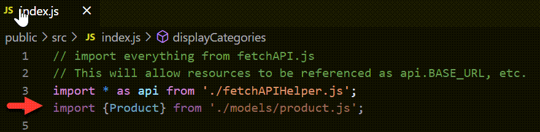
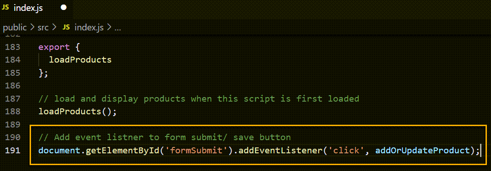
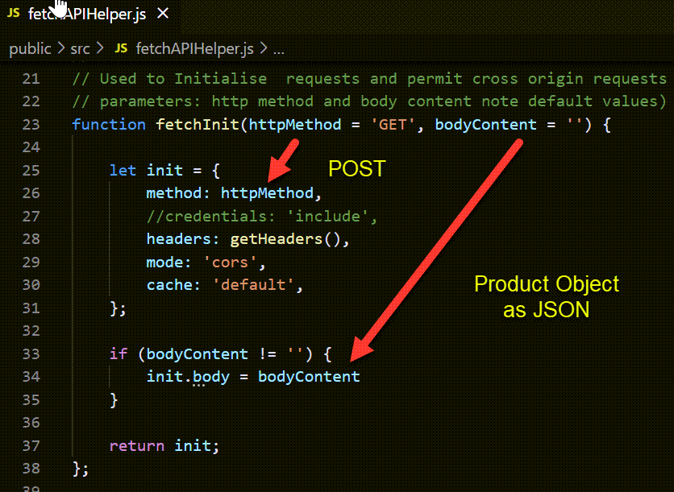

# Web API Lab 5: Web Client - Add new Products Form

Enda Lee 2021

## Introduction

In this lab you will add the ability to create new products via an HTML form in the client web application.

### Prerequisites

**Client-side**

Use the start site in this repository

**Server-side**

The client functionality is dependent on a server API completed up to the last lab. This includes endpoints and  supporting create, read, update, and functionality:

[https://github.com/elee-tudublin/SQLite-db-api-2021.part4-Add-Update-Delete](https://github.com/elee-tudublin/SQLite-db-api-2021.part4-Add-Update-Delete)

As usual, open the client and server applications in their own VS Code instances to work on this lab. Install dependencied in each using **npm install**, then start both applications using **npm run dev**.

The finished site will include an **Add Product** button, when clicked this will reveal a modal form where details for the new product can be entered and submitted. The form is also displayed for editing existing products.


For more about modal dialogs using Bootstrap 5, see [https://getbootstrap.com/docs/5.0/components/modal/](https://getbootstrap.com/docs/5.0/components/modal/)


## Part 1: The Product Form

As mentioned above, the product form has been modified so that it displays as a modal dialog. By default it is hidden and only displayed when thhe **Add Product** or an **Edit** button iis clicked. When displayed it aquires *focus* and the page is greyed out in the background.

To see the new form, open **index.html**:



## Part  2: Submit the form and send in a POST request to the API

When the form is submitted, the value entered need to be read and then sent to the API as a **POST request** to the **/product** endpoint.

### 2.1 The Product Model Object (client-side)

In the server-side API, products are defined by the Product model. The model also be used to define a product on the client-side. This is for consistency so that product objects always look the same.

Open **product.js** to see the **Product Object** definition.



To use the **Product** model, import at the top of **index.js**:



### 2.2 Read the form values.

After the add product form is filled, the user will click the Save button which in turn calls a function to **```addOrUpdateProduct()```**

1. First add an **event listener** for the **save** button at the end of index.js:
   

2. Add the **```addOrUpdateProduct()```** function:

   This function will read the form values and send them as part of a request to the API endpoint responsible for adding new products. Note that the default HTTP method is **POST**, for **inserts**. New products have **_id == 0**. 

   *See comments for details*

   ```javascript
   //
   // Called when add product form is submitted
   async function addOrUpdateProduct() {
   
     // url for api call
     const url = `${api.BASE_URL}/product`
     // New product = POST, Update = PUT
     let httpMethod = 'POST';
   
     // Get the form data as a Product Object
     const formProduct = getProductForm();
     // log to console
     console.log('%cNew Product: ', 'color: green', formProduct);
   
     // Check if new product or update
     // Only existing products have formProduct._id > 0
   
     // use fetchInit to build the request
     // The second param is the form data (product Object) which is sent as JSON in the request body
     const request = api.fetchInit(httpMethod, JSON.stringify(formProduct)); 
   
     try {
       // Call fetch and await the respose
       // fetch url using request object
       const result = await api.getDataAsync(url, request);
       // Output result to console (for testing purposes) 
       console.log(result);
       // catch and log any errors
     } catch (err) {
       console.log(err);
       return err;
     }
   
     // Refresh products list (to show the newly added product)
     loadProducts();
   } // End function
   ```

3. The **```getProductForm()```** function.

   This function is used by **```addOrUpdateProduct()```** to read values filled in the form and return them as a **new Product Object**. 

   ```javascript
   // Get values from product form
   // Create new Product and return
   function getProductForm() {
     // new Product object constructed from the form values
     // Note: These should be validated!!
     return new Product(
       // read the form values and pass to the Product constructor
       document.getElementById('_id').value,
       document.getElementById('category_id').value,
       document.getElementById('product_name').value,
       document.getElementById('product_description').value,
       document.getElementById('product_stock').value,
       document.getElementById('product_price').value,
     );
   } // End function
   ```

4. The new Product object is converted to JSON and sent in the request body. The **```fetchInit()```** function, defined in **fetchAPIHelper.js** is used to generate a request object in the correct format allowing the **Product** object to be sent as **JSON** in the **body** of  a **POST** request:
      

5. **```api.getDataAsync(url, request)```** is then used to call the api at the endpoint specified by **url**.


## Exercises

1. Modify **```addOrUpdateProduct()```***, adding functionality to update existing products. 
2. Implement Delete product using a button for each product, similiar to  edit product.

